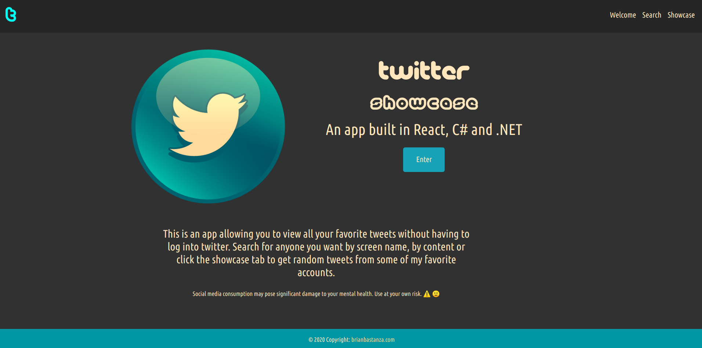
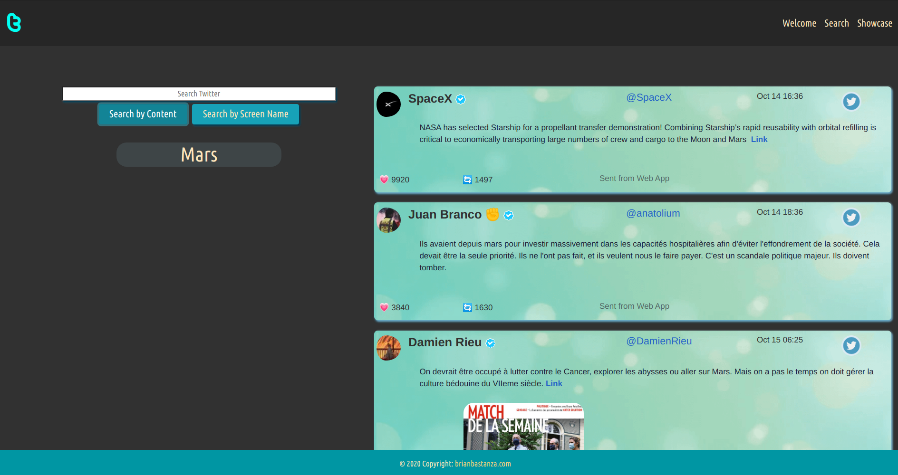
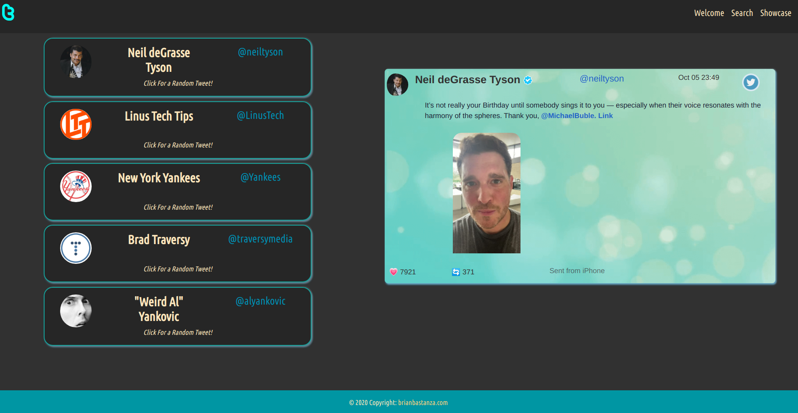

# Twitter Showcase

> A full stack web app built in C# with ASP.Net Core, React JS and styled with Bootstrap4


Check out the app [HERE](https://twittershowcase.azurewebsites.net/)!







## Summary

This is my first full stack web application. I built this app to learn the complexities of building a web application from top to bottom and to further my knowledge of C#, .Net, React, Bootstrap and to learn how to seperate conserns between back end development and front end development.

There was a lot of new experience to gain while building this application and there were many challenges to overcome while building this project. It is important for me to get comfortable with maintaining projects with more complexity and more moving parts. I am starting to see the value of using a high powered backend framwork, such as .net and specifically APS.Net. I, also, was very excited to continue to gain experience with React and I am starting to feel very comfortable navigating the React JS framework.

Specific things I used and learned while building this application:

> Create ASP.Net Core Application

> Create services, controllers, and models to handle recieving API calls and make calls from a back end

> Dependency injection for C# classes

> Parsing data recieved from Twitter to return only what was needed to my front end application

> Building an API from scratch

> Styling React with Bootstrap 4

> Deployment to Microsoft Azure

## Installation

To run this application locally you need to add a file called `appsettings.Development.json` in the `API/` directory. The contents of the file should be the following:

```
{
  "Logging": {
    "LogLevel": {
      "Default": "Information",
      "Microsoft": "Warning",
      "Microsoft.Hosting.Lifetime": "Information"
    }
  },
  "Twitter_Key": {
    "BearerToken": "<Insert Twitter Bearer Token Here>"
}
}
```

You can get a Twitter bearer token from `https://developer.twitter.com/`, signing up for a developer account and creating a twitter web application.

You can then go to the `API/Client/` directory and run

```
npm i
```

Move to the `API/` folder and run

```
dotnet watch run
```

to start the application locally.

## Author

### Brian Bastanza- Full Stack Web Developer

<a href="https://www.brianbastanza.me/" target="_blank" rel="noopener">Personal Website</a>

[LinkedIn](www.linkedin.com/in/bbastanza)
